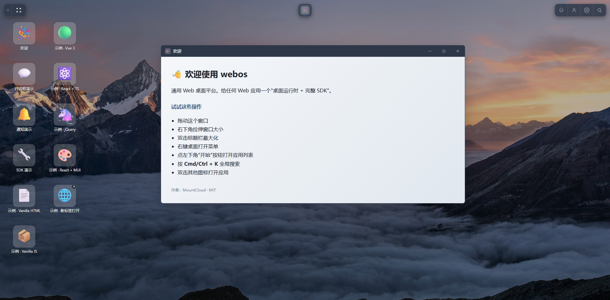
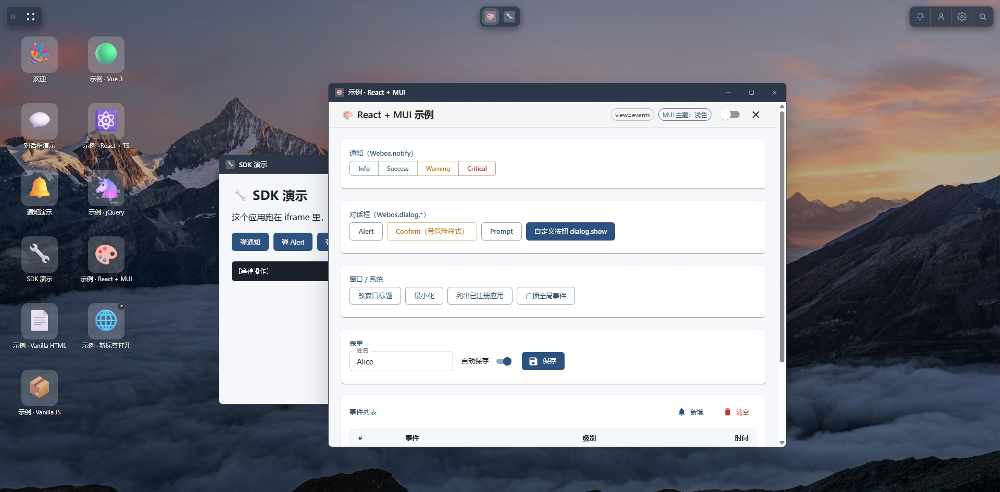
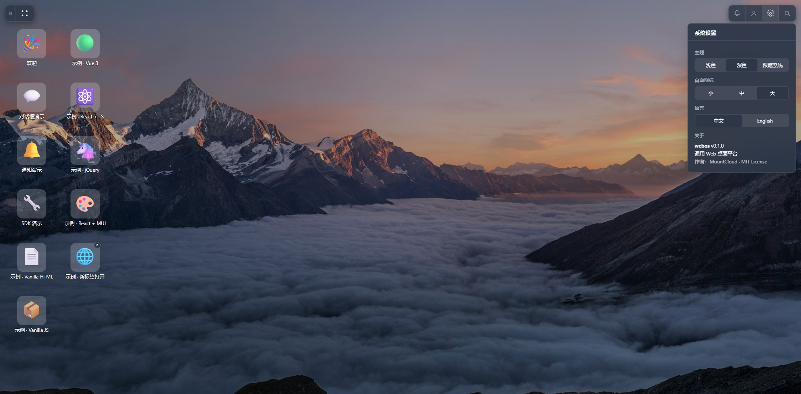
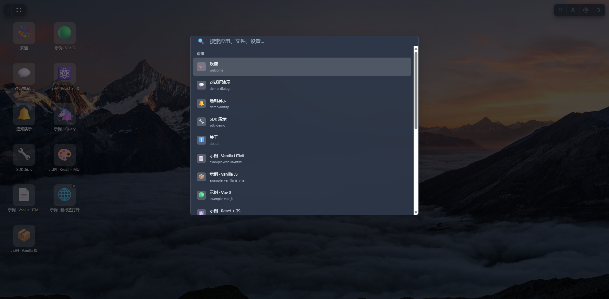
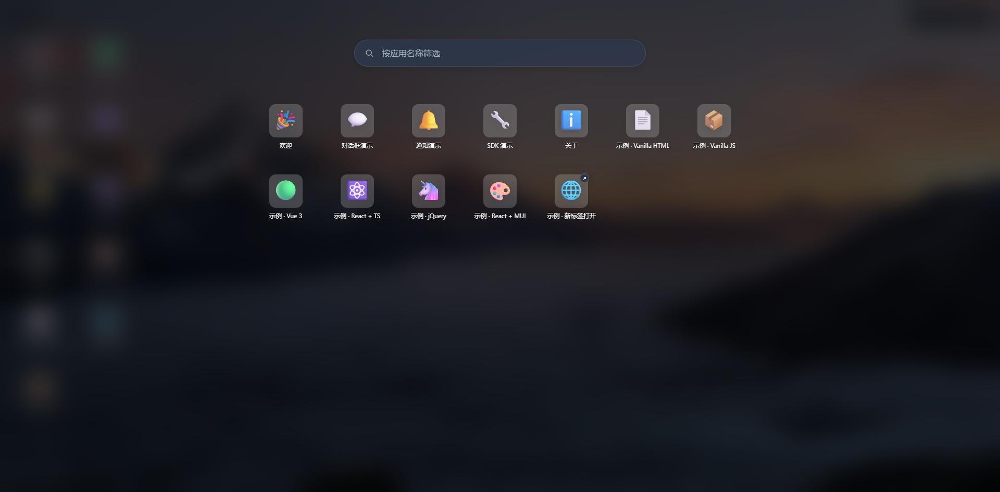

# WebOs

通用 Web 桌面平台。

## 协议

必须是人人都爱的**MIT**协议。详见 [LICENSE](./LICENSE)。


# 应用

任何 Web 应用一个"桌面运行时 + 完整 SDK"，让 Vue / React / jQuery / 纯 HTML 等任意栈的应用以**窗口形态**跑在 webos 桌面上，并通过 `@webos/host-sdk` 调用通知、对话框、跨应用消息、主题、存储、深链跳转等桌面级能力。

---

## 一键启动（推荐）

```bash
pnpm install        # 安装所有 workspace 依赖
pnpm dev:all        # 同时起 webos 主程序 + 4 个 Vite 示例
```

跑起来后浏览器自动打开 <http://localhost:5173>。占用端口：

| 端口 | 服务 | 说明 |
|------|------|------|
| 5173 | webos shell | 主程序桌面 |
| 5501 | example-vanilla-js-vite | 示例 02 |
| 5502 | example-vue-js | 示例 03 |
| 5503 | example-react-ts | 示例 04 |
| 5504 | example-react-mui | 示例 06（推荐生产用法） |

示例 01（Vanilla HTML）和 05（jQuery）是静态页，由 webos shell 的 dev server 直接托管在 `/examples/01-vanilla-html/` 和 `/examples/05-jquery-legacy/` 路径，不占额外端口。

---

## 桌面上能做什么

打开 <http://localhost:5173> 后会看到：

- **左上角胶囊**：`▌▌` 显示桌面（一键最小化所有 / 再点恢复） · `⚫⚫` 主菜单（全屏 launcher，按应用名筛选）
- **顶部居中浮动 dock**：运行中的窗口列表，点切换 / 再点最小化 / 右键关闭
- **右上角胶囊**：`🔔` 消息中心 · `👤` 用户菜单（占位）· `⚙` 设置面板（主题 / 图标大小 / 语言）· `🔍` 全局搜索（Cmd/Ctrl+K）
- **桌面图标**（左侧竖排）：8 个示例应用 + 演示 dialog/notify 的内置 demo

试这些操作（最能感受功能）：

1. **`Cmd/Ctrl + K`** 打开全局搜索 → 输入 `事件` → 选中"事件列表 - React + MUI 示例" → **直接进 React 应用的事件页**（深链 + 子功能注册示范）
2. 双击多个示例图标 → dock 上看运行中的窗口 → 拖动窗口标题栏移动 / 拖边缘缩放 / 双击标题栏最大化
3. 右上角 ⚙ → 主题切换深 / 浅，**整个桌面 + 所有 iframe 应用同时变色**（含 MUI 应用，通过 `@webos/mui-theme`）
4. 右上角 ⚙ → 桌面图标 → 小 / 中 / 大，图标实时缩放，刷新页面后保持
5. 双击 🌐 "新标签打开" → 在浏览器**新标签**打开（演示 `launchMode: 'tab'`）
6. 在 React+MUI 示例里点"自定义按钮 dialog.show" → 三个自定义按钮 + Esc/Enter 键支持

---

## 单独启动某一个

```bash
pnpm dev                                  # 只起 webos shell
pnpm --filter example-react-mui dev       # 单起 React+MUI 示例
pnpm --filter example-vue-js dev          # 单起 Vue 示例
pnpm dev:examples                         # 起所有 Vite 示例（不含 shell）
```

---

## 创建新应用（CLI）

用 `create-webos-app` 脚手架一键创建 webos 应用，含 8 种模板：

```bash
# 交互式
npm create webos-app
# 或
pnpm create webos-app

# 非交互式
npx create-webos-app my-app -t react-mui-js
npx create-webos-app my-app --template vue-js
```

可用模板：

| ID | 栈 |
|----|----|
| `react-mui-js` ⭐ | React + MUI + WebosThemeProvider · JavaScript（生产推荐） |
| `react-mui-ts` | 同上但带 TypeScript |
| `react-js` / `react-ts` | 不带 MUI 的 React |
| `vue-js` | Vue 3 + Composition API |
| `vanilla-js` | Vanilla JS + Vite |
| `vanilla-html` | 纯 HTML + UMD CDN，零构建 |
| `jquery` | jQuery + UMD（老项目无痛接入） |

详见 [`packages/create-webos-app/README.md`](./packages/create-webos-app/README.md)。

---

## 构建

```bash
pnpm build                # 全 workspace 生产构建
pnpm build:shell          # 仅 webos shell
pnpm build:packages       # 仅 npm 包（@webos/host-sdk、@webos/mui-theme）
```

---

## 目录结构

```
osweb/
├── apps/
│   └── webos-shell/             # 桌面壳（TS + Vite，主程序）
├── packages/
│   ├── host-sdk/                # @webos/host-sdk —— 应用 SDK（任意栈通用）
│   ├── mui-theme/               # @webos/mui-theme —— React + MUI 应用主题适配
│   └── create-webos-app/        # CLI 脚手架（8 种模板）
├── examples/
│   ├── 01-vanilla-html/         # 纯 HTML + UMD CDN，零构建
│   ├── 02-vanilla-js-vite/      # Vanilla JS + Vite
│   ├── 03-vue-js/               # Vue 3 + JS
│   ├── 04-react-ts/             # React 18 + TypeScript
│   ├── 05-jquery-legacy/        # jQuery + UMD（老项目无痛接入）
│   └── 06-react-mui/            # ⭐ React + MUI + WebosThemeProvider（推荐生产用法）
├── docs/
│   ├── HOST_SDK_API.md          # SDK 完整 API 参考
│   ├── APP_DEVELOPER_GUIDE.md   # 应用开发指南（多栈接入）
│   ├── APP_MANIFEST_SPEC.md     # manifest 规范（entries 多入口 + contributes 扩展点）
│   ├── MUI_INTEGRATION.md       # React + MUI 接入指南
│   ├── ARCHITECTURE.md          # 架构总览
│   ├── THEME_DEVELOPER_GUIDE.md # 主题开发指南
│   ├── DESIGN.md                # 模块详细设计
│   ├── TECH_STACK.md            # 技术栈选型
│   └── LEARNING_NOTES.md        # 设计回顾笔记
├── README.md                    # 本文件
├── NOTICE.md                    # 致谢与协议归属
└── osweb-plan.md                # 项目方案与任务清单
```

---

## 核心能力一览

### 主程序（webos shell）

- 多窗口管理（拖拽 / 缩放 / 最大化 / 最小化 / 关闭）
- 桌面 + 顶栏（左右胶囊）+ 顶部居中 dock
- 全屏 launcher 主菜单（Ubuntu / Synology DSM 风格）
- 全局搜索（Cmd/Ctrl + K）—— 应用 / 子功能 / 命令三段分组
- 通知中心 + toast（4 种 level，最多堆 5 条）
- 对话框（alert / confirm / prompt / **自定义按钮 dialog.show**）
- 上下文菜单（多级嵌套）
- 主题（浅 / 深 / 跟随系统）+ 图标大小（小 / 中 / 大）+ 中英文 i18n

### `@webos/host-sdk`（应用接入）

```ts
import { Webos } from '@webos/host-sdk'

await Webos.notify({ title: '保存成功', level: 'success' })
const ok = await Webos.dialog.confirm({
  message: '永久删除?', confirmText: '删除', danger: true
})
await Webos.window.setSize(800, 600)
await Webos.window.setTitle('未保存 - 文档.txt')
const info = await Webos.app.bootInfo()        // { appId, feature?, params? }
Webos.events.on('app.navigate', ({ feature, uri }) => router.push(uri))

// 用户身份 / token —— 跨应用共享，登录页写入后所有应用立即可用
const user = await Webos.user.current()
const accessToken = await Webos.user.accessToken()
Webos.user.on('change', ({ user }) => {
  if (!user) location.href = '/login.html'
})
```

完整 API 见 [docs/HOST_SDK_API.md](./docs/HOST_SDK_API.md)。

#### 同 origin 登录页

提供独立登录页（与 webos 同协议 + 同域 + 同端口）的场景，登录页用 SDK 暴露的纯函数直接写 localStorage，**不走 RPC**：

```ts
import { writeWebosSession } from '@webos/host-sdk'

writeWebosSession({
  user: { id, name, email, permissions },
  token: { accessToken, refreshToken,
           expiresAt: Date.now() + expiresIn * 1000 },
})
location.href = '/'   // 跳到 webos
```

webos 启动时 `UserSession` 从同一个 LS key 自动恢复。**登录页 / RPC 调用 / shell 内部** 三条路径走的是同一份持久化底层，单一真实来源。

### `@webos/mui-theme`（React + MUI 应用专用）

```tsx
import { WebosThemeProvider } from '@webos/mui-theme'

<WebosThemeProvider>
  <App />
</WebosThemeProvider>
```

一行 Provider 让 MUI 主题跟随 webos 桌面切换深浅色。详见 [docs/MUI_INTEGRATION.md](./docs/MUI_INTEGRATION.md)。

---

## 给应用注册子功能

manifest 在 `entries[i].features` 下声明，让全局搜索直接跳到应用内具体页面：

```json
{
  "appId": "com.acme.crm",
  "name": "CRM",
  "entries": [
    {
      "id": "main",
      "name": "CRM",
      "icon": "...",
      "uri": "https://crm.acme.com/",
      "features": [
        {
          "id": "new-customer",
          "name": "新建客户",
          "uri": "/customers/new",
          "keywords": ["新建", "客户", "create"]
        },
        {
          "id": "reports",
          "name": "销售报表",
          "uri": "/reports",
          "category": "报表"
        }
      ]
    }
  ]
}
```

用户在搜索里输 "新建客户" → 选中 → CRM 启动并直接跳到 `/customers/new`。已运行的 CRM 不会重新加载，桌面壳推送 `app.navigate` 事件由应用 SPA 路由响应。详见 [docs/APP_MANIFEST_SPEC.md](./docs/APP_MANIFEST_SPEC.md)。

---

## 启动模式

每个 entry 可在 manifest `entries[i].launchMode` 里指定：

| 模式 | 行为 | 适用场景 |
|------|------|----------|
| `window`（默认） | iframe 进 webos 窗口，可用全部 SDK | 普通业务应用 |
| `tab` | `window.open` 浏览器新标签 | 大屏 BI / SSO 入口 / 拒绝 X-Frame 嵌入的页面 |

---

## 效果

### 主页



### 多窗口&SDK



### 系统设置



### 搜索



### 主菜单

